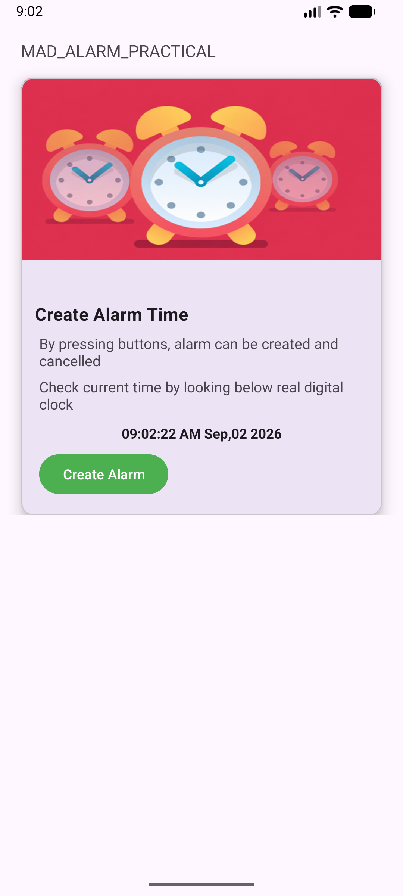
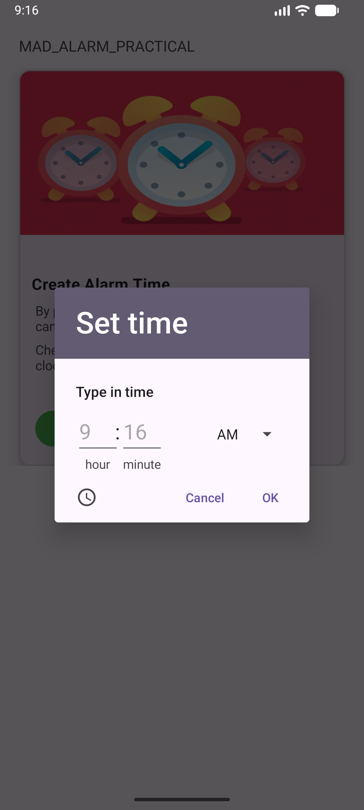
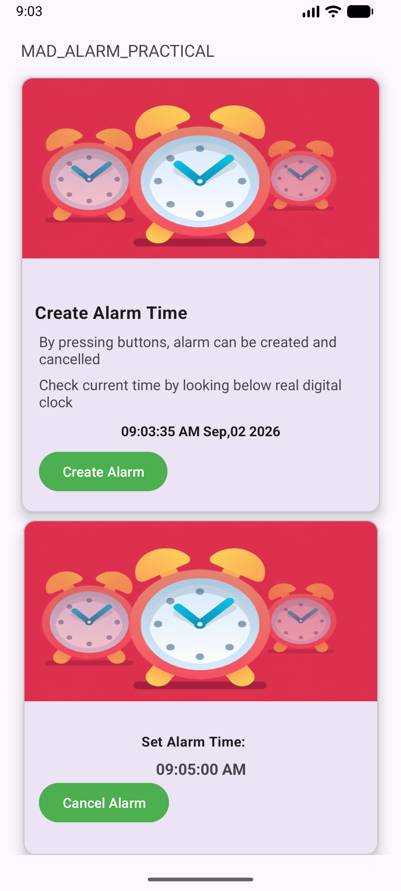

# 📱 Practical-4: Android Alarm Application

## 🎯 Aim

Create an Android Alarm application using **AlarmManager, BroadcastReceiver, and Service** in Kotlin.

---

## 📖 Description

This practical demonstrates how to create an **Android Alarm Application** using **AlarmManager, BroadcastReceiver, and Service**.

The application allows the user to select a specific time using **TimePicker**, create an alarm, play the default alarm ringtone when the selected time is reached, and cancel the alarm when required.

---

## ✨ Features

* Display the current digital time.
* Select alarm time using **TimePicker**.
* Create an exact alarm using **AlarmManager**.
* Play the default alarm ringtone at the selected time.
* Display the selected alarm time.
* Cancel the created alarm.
* Uses **BroadcastReceiver** to receive the alarm event.
* Uses **Service** to play the alarm ringtone.

---

## 🛠️ Technologies Used

* **Language:** Kotlin
* **IDE:** Android Studio
* **Platform:** Android
* **UI:** XML

---

## 🧩 Android Components Used

* Activity
* AlarmManager
* BroadcastReceiver
* Service
* TimePickerDialog
* PendingIntent
* Intent
* MediaPlayer

---

## 🔄 Application Flow

1. Open the Android Alarm Application.
2. The current time is displayed on the home screen.
3. Tap on **Create Alarm**.
4. Select the required time using the **TimePicker**.
5. The alarm is scheduled using **AlarmManager**.
6. The selected alarm time is displayed on the screen.
7. When the selected time is reached, **BroadcastReceiver** receives the alarm event.
8. The BroadcastReceiver starts the **AlarmService**.
9. The Service plays the default alarm ringtone.
10. Tap **Cancel Alarm** to cancel the scheduled alarm.

---

## 📂 Project Structure

```text
app
├── manifests
│   └── AndroidManifest.xml
├── kotlin+java
│   ├── MainActivity.kt
│   ├── AlarmReceiver.kt
│   └── AlarmService.kt
├── res
│   ├── layout
│   │   └── activity_main.xml
│   ├── drawable
│   ├── mipmap
│   ├── values
│   └── raw
```

---

# 📸 Output Screenshots

## 1. 🏠 Home Screen

The home screen displays the current digital time along with **Create Alarm** and **Cancel Alarm** buttons.



---

## 2. 🔐 Alarm Permission

The application requests permission to schedule exact alarms before creating an exact alarm.


---

## 3. ⏰ Time Picker

The user selects the desired alarm time using the Android **TimePicker** dialog.



---

## 4. ✅ Alarm Created

After selecting the required time, the alarm is successfully created and the selected alarm time is displayed on the screen.



---

## 🎯 Conclusion

Thus, the **Android Alarm Application** was successfully created using **AlarmManager, BroadcastReceiver, and Service** in Kotlin.

The application successfully allows the user to **select an alarm time, create an exact alarm, play the alarm ringtone at the selected time, display the alarm time, and cancel the alarm**.
